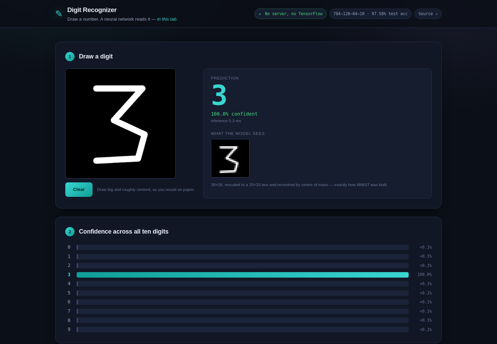

# Digit Recognizer

**Draw a number. A neural network reads it — running in your browser as plain JavaScript.**

[](https://devapriyan-s.github.io/digit-recognizer/)
[](https://github.com/Devapriyan-S/digit-recognizer/actions/workflows/tests.yml)
[](LICENSE)

### ▶ [**Open the live demo**](https://devapriyan-s.github.io/digit-recognizer/)



---

| | |
|---|---|
| Architecture | 784 → 128 → 64 → 10, ReLU |
| Parameters | 109,386 |
| **Test accuracy** | **97.58%** on the 10,000 held-out MNIST images |
| Model size | 147 KB (int8-quantised) |
| Load time | ~11 ms |
| Inference | ~0.3 ms |
| Dependencies | none — no TensorFlow.js, no ONNX runtime |

## The part that actually matters

The network is the easy half: three dense layers and a ReLU, about forty lines
of JavaScript. What decides whether the demo works at all is the preprocessing.

**MNIST images are not raw drawings.** Every digit in the dataset was scaled so
its bounding box fits a 20×20 area, then placed into a 28×28 field centred by
its **centre of mass** — not the centre of its bounding box. A model trained on
that has never seen a digit drawn small in the corner of a 320×320 canvas.

So most in-browser digit demos do this:

```js
ctx.drawImage(canvas, 0, 0, 28, 28);   // ← confident nonsense
```

…and then blame the model. `normalise()` reproduces the original pipeline
instead: find the ink's bounding box, scale it to 20×20 **preserving aspect
ratio** (so a `1` stays narrow rather than being stretched toward a `7`),
box-filter downsample (nearest-neighbour drops thin strokes entirely), compute
the centre of mass, and offset so it lands at (14, 14).

The demo shows you the resulting 28×28 image. When a prediction surprises you,
the preview usually explains it.

## Verified, not assumed

A re-implemented forward pass is exactly the kind of code that looks right and
is off by a transpose. `tests/model.test.mjs` runs 40 real MNIST test images
through the JavaScript and compares against logits computed in NumPy from the
same quantised bundle:

```
worst logit difference       4.77e-6
worst probability difference 4.77e-7
predictions agreeing with NumPy  40/40
```

It also pins the preprocessing down:

- A blank canvas is reported empty, not classified as some digit
- A mark drawn in the corner recentres to (14.5, 14.5) — target (14, 14)
- A tall thin stroke keeps its aspect ratio (w/h 0.10 in, 0.10 out) instead of being stretched square
- The scaled digit fits MNIST's 20×20 box

And the browser build is driven with Playwright, which draws five digit shapes
with real pointer events and checks what comes back — currently 5/5.

## Two details worth calling out

**Quantisation.** Weights are symmetric per-tensor int8 with a float scale.
That's 147 KB against 440 KB of float32, and costs **0.01 accuracy points**
(97.58% → 97.57%). `train.py` verifies this by running the exported int8 bundle
over the full test set before writing it — a silent accuracy collapse from
quantisation would otherwise only surface when someone tried the demo.

Encoding matters too: written as a JSON array of integers the file is 320 KB,
because `-127,` costs five characters per weight. Base64'd raw bytes it's
147 KB — and still smaller after gzip (96 KB vs 101 KB).

**Softmax overflow.** Logits are max-shifted before `exp()`. Without it a
confident logit becomes `Infinity` and every probability comes back `NaN` — a
bug that hides well, because argmax over NaNs often still returns something.

## Where it genuinely struggles

Its most frequent mistakes on the held-out test set, worst first:

| Truth | Read as | Times |
|---|---|---|
| 8 | 3 | 19 |
| 5 | 3 | 15 |
| 4 | 9 | 13 |
| 9 | 3 | 9 |
| 7 | 2 | 9 |
| 6 | 5 | 9 |

An MLP has no spatial priors, so it learns pixel patterns rather than strokes —
`8` and `3` share most of their right half. A small CNN would cut the error
roughly in half, at the cost of needing a real deep-learning runtime in the page.

## Run it

```bash
git clone https://github.com/Devapriyan-S/digit-recognizer.git
cd digit-recognizer

npm test                            # JS vs NumPy, plus preprocessing
python -m http.server 8000 -d web   # open http://localhost:8000
```

Retrain from scratch (downloads MNIST on first run):

```bash
pip install -r requirements.txt
python train.py                     # ~2 min, rewrites web/model/weights.json
```

## Limits

- **MLP, not a CNN.** No translation invariance and no stroke understanding.
  97.58% is close to the ceiling for this architecture; a CNN reaches ~99.3%.
- **Trained on MNIST, which is American handwriting from the 1990s.** European
  `7` with a crossbar and `1` with a full serif base are under-represented and
  read less reliably.
- **Stroke width is fixed.** Drawing very thin or very thick relative to the
  pad shifts the input away from the training distribution.
- **Single digit only.** No segmentation, so multi-digit numbers are not read.

---

MIT licensed. Built by **Devapriyan Sampath** — [portfolio](https://devapriyan-s.github.io/) · [LinkedIn](https://www.linkedin.com/in/deva-priyan-sampath-2091a7288/) · [devapriyan1723@gmail.com](mailto:devapriyan1723@gmail.com)
